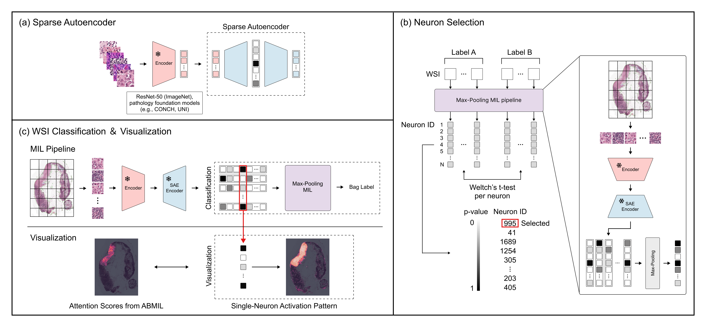

# Patch-level phenotype identification via weakly supervised neuron selection in sparse autoencoders for CLIP-derived pathology embeddings

Computer-aided analysis of whole slide images (WSIs) has advanced rapidly with the emergence of multi-modal pathology foundation models. In this study, we propose a weakly supervised neuron selection approach to extract disentangled representations from CLIP-derived pathology foundation models, leveraging the interoperability of sparse autoencoders. Specifically, neurons are ordered and selected using whole-slide level labels within a multiple instance learning (MIL) framework. We investigate the impact of different pre-trained image embeddings derived from general and pathology images and demonstrate that a selected single neuron can effectively enable tile-level phenotype identification. Experiments on the Camelyon16 dataset demonstrate that the proposed method achieves state-of-the-art performance in tumor patch identification.

## Reference Repositories
This repository is primarily inspired by the following projects:
- [BatchTopK](https://github.com/bartbussmann/BatchTopK)
- [CLAM](https://github.com/mahmoodlab/CLAM)
- [MambaMIL](https://github.com/isyangshu/MambaMIL)
